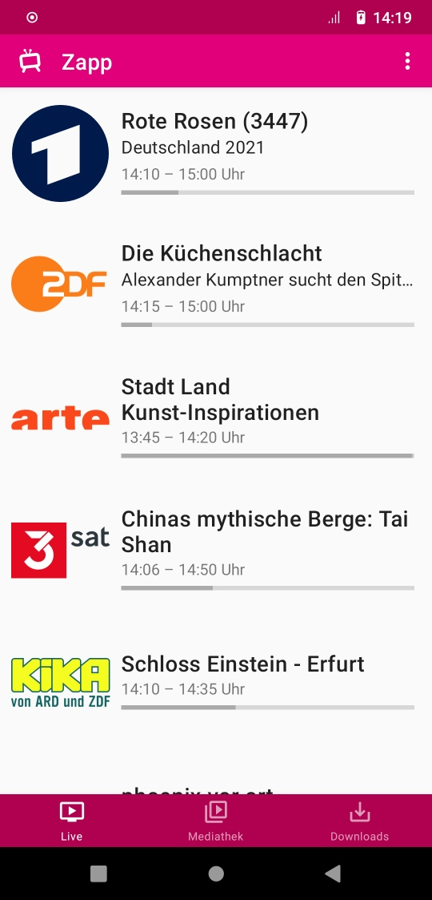
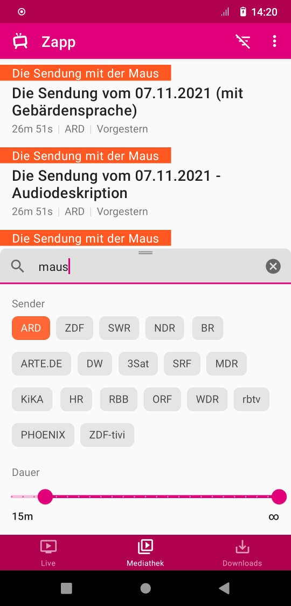
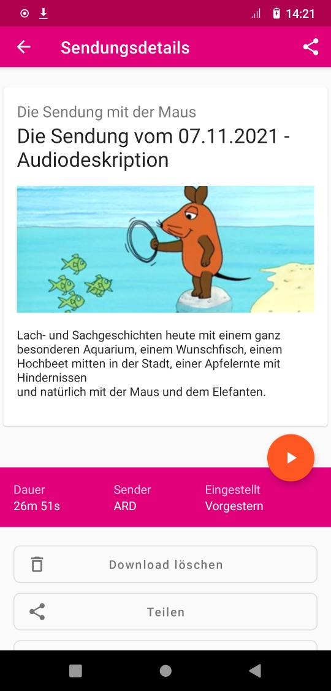
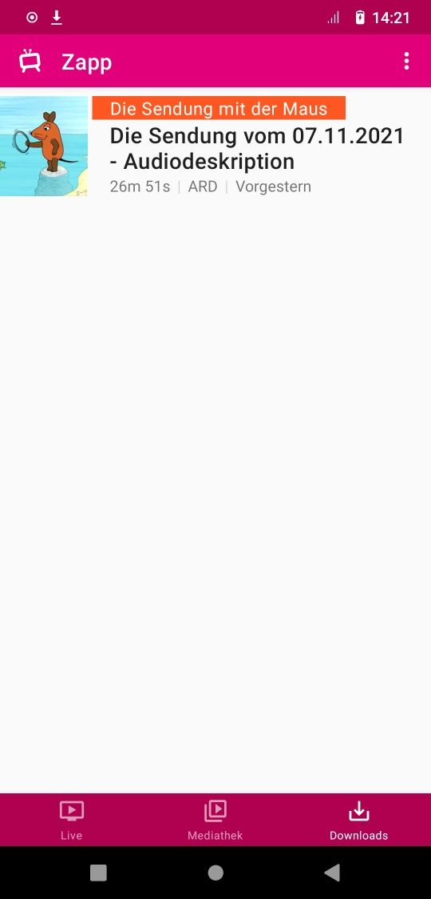
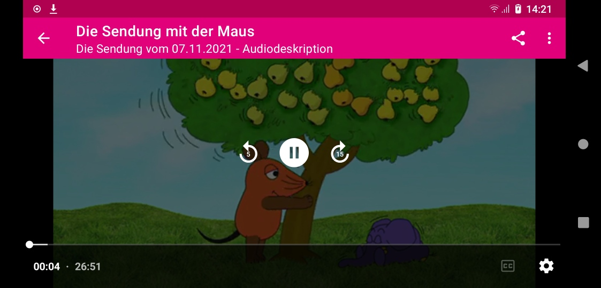
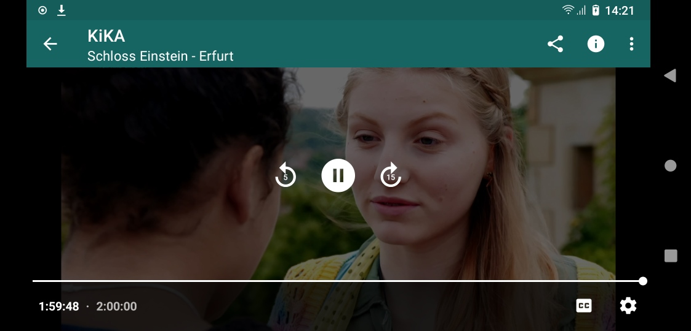

1. [Über](#über)
2. [FAQ](app/src/main/res/raw/faq.md)
3. [Changelog](app/src/main/res/raw/changelog.md)
4. [Bibliotheken](#bibliotheken)

---------------------

## Über

Zapp ist Teil von MediathekView und gibt dir einen schnellen Zugang zu vielen deutschen öffentlich-rechtlichen Fernsehsendern. Schaue ARD, ZDF und andere Sender live oder aus der Mediathek.

<b>Features:</b>
<ul>
	<li>Android-Client für MediathekView</li>
	<li>Live-Streams von über 30 Sendern</li>
	<li>Adaptives Streaming — passend zur Geschwindigkeit deiner Netzwerkverbindung</li>
	<li>Schneller Sender-Wechsel</li>
	<li>Aktuelle Programminformationen</li>
	<li>Sender-Shortcuts für neuere Android-Versionen</li>
	<li>Sendungen aus fast 20 Mediatheken zum Streamen</li>
	<li>Bequeme Sendungssuche in der Mediathek</li>
	<li>Zuschaltbare Untertitel für einige Mediathek-Sendungen</li>
	<li>Teilen-Funktion für Live- und Mediathek-Videos</li>
	<li>Hintergrund-Playback</li>
</ul>

**Achtung:** Wenn du Zapp außerhalb Deutschlands benutzt, können manche Sender — wie zum Beispiel ZDF — geblockt sein.

    

---------------------

## Übersetzungen

Zapp wird in Deutsch entwickelt, kann aber über [Hosted Weblate](https://hosted.weblate.org/projects/zapp/) in andere Sprachen übersetzt werden. 

## Bibliotheken

Zapp uses a lot of awesome libre-software libraries:
- [JUnit](https://junit.org/junit4/) to test things out
- [Gson](https://github.com/google/gson) to parse the list of channels
- [Commons IO](https://commons.apache.org/proper/commons-io/) for a sane way to handle files on Android
- [DragListView](https://github.com/woxblom/DragListView) to let you reorder the channel list intuitively
- [ExoPlayer](https://google.github.io/ExoPlayer/) the better video player
- [Retrofit](https://square.github.io/retrofit/) for easy server api communication
- [Joda-Time](https://www.joda.org/joda-time/) for sane date and time handling in Java
