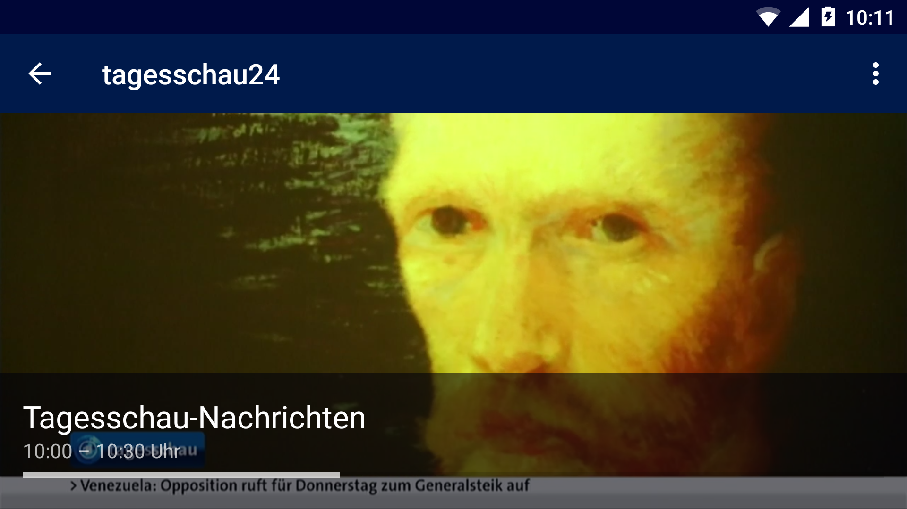
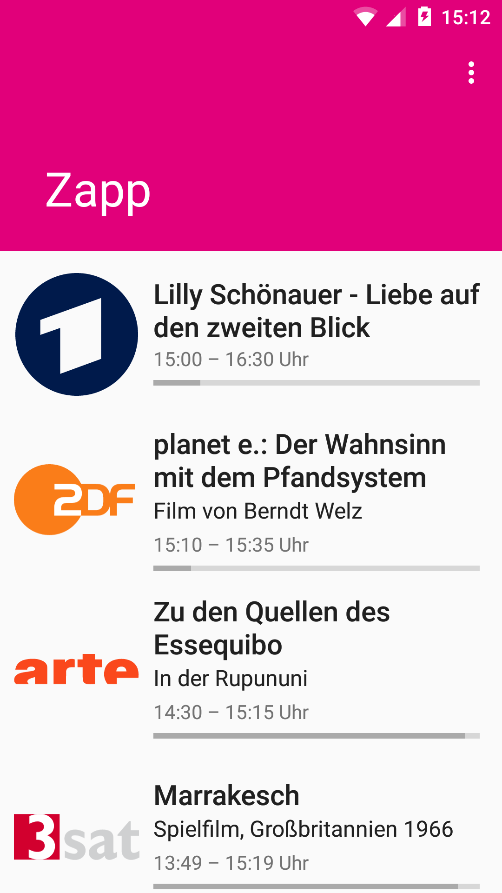
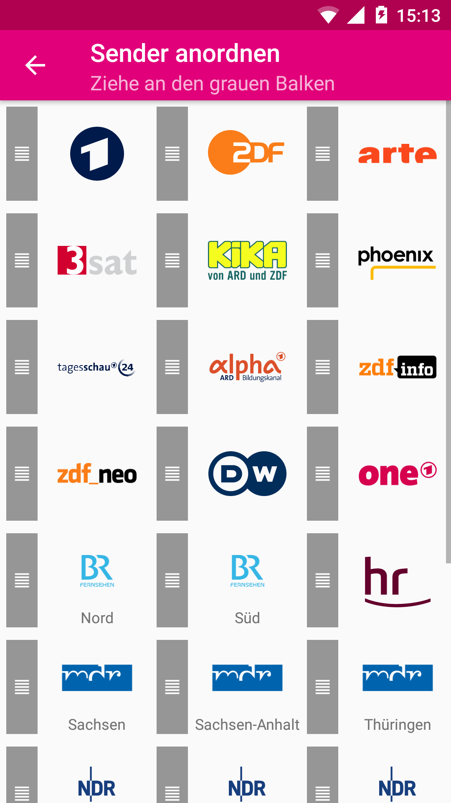
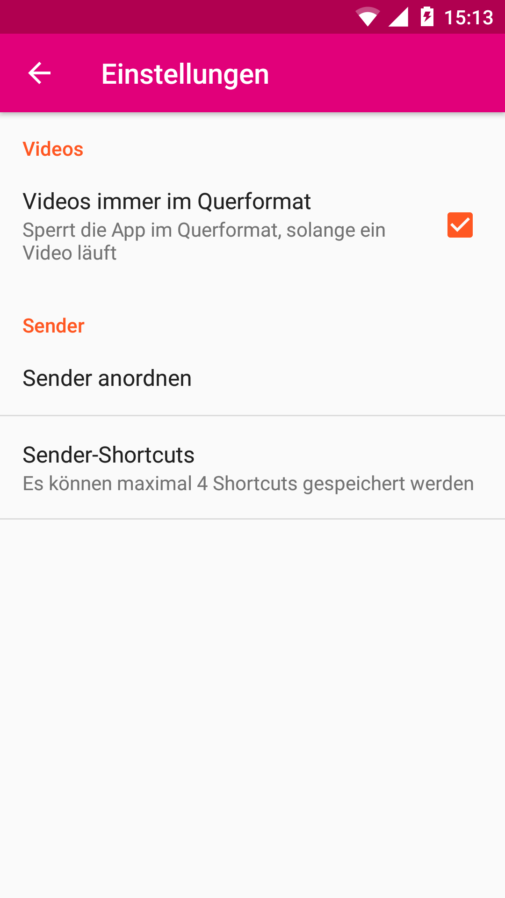

1. [About](#about)
2. [FAQ](#faq)
3. [Libraries Example](#libraries)

## About

Zapp gives you easy access to a large number of German public broadcasting live streams. Watch ARD, ZDF and other channels live. Zapp makes it easy to quickly switch between channels.

 

---------------------

## FAQ

### The videos do not play, what should I do?

The are multiple reasons why the streams won't play on Android:

- Maybe you are using Zapp outside of Germany. Some channels may block access
to their streams or to single shows for users outside of Germany. When in doubt
head the the channels website (using a desktop) and check out the live stream
there. If you get an error message about **geoblocking** there, Zapp can't do 
anything about it right now.

- Maybe your internet connection is wonky or blocked by a firewall.

- Maybe you Android device can't handle the video codec. You can share the 
stream to another video player by pressing the menu button after selecting a
channel. Click "Teilen" and let Google Video Player open the stream. If Google
Video Player is not able to play back the stream your device most likely cannot
handle the video format.

### Why don't I see any show info for a specific channel?

Most channels don't have any public API to get EPG data from. So Zapp tries to
parse channel websites for the shows currently running. This approach is not
very reliable and may break whenever the websites change or update.

### Why are there channels missing, like RTL or Pro7?

Zapp does only stream public broadcasting channels. Channels like RTL and Pro7
are owned by private companies and are not allowed to be streamed without paying
for them.

---------------------

## Libraries

Zapp uses a lot of awesome open source libraries:
- [JUnit](http://junit.org/junit4/) to test things out
- [Gson](https://github.com/google/gson) to parse the list of channels
- [Commons IO](https://commons.apache.org/proper/commons-io/) for a sane way to handle files on Android
- [Paperboy](https://github.com/porokoro/paperboy) to easily display a nice looking changelog
- [DragListView](https://github.com/woxblom/DragListView) to let you reorder the channel list intuitively
- [Butterknive](https://jakewharton.github.io/butterknife/) to avoid writing a lot of boilerplate code
