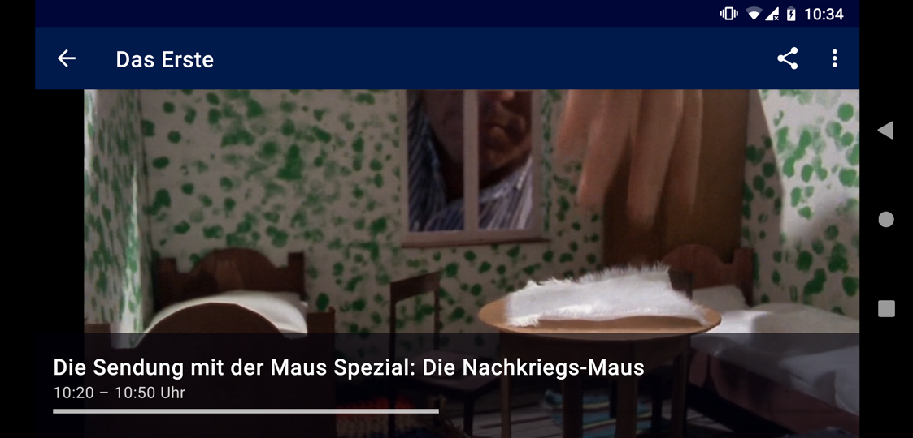
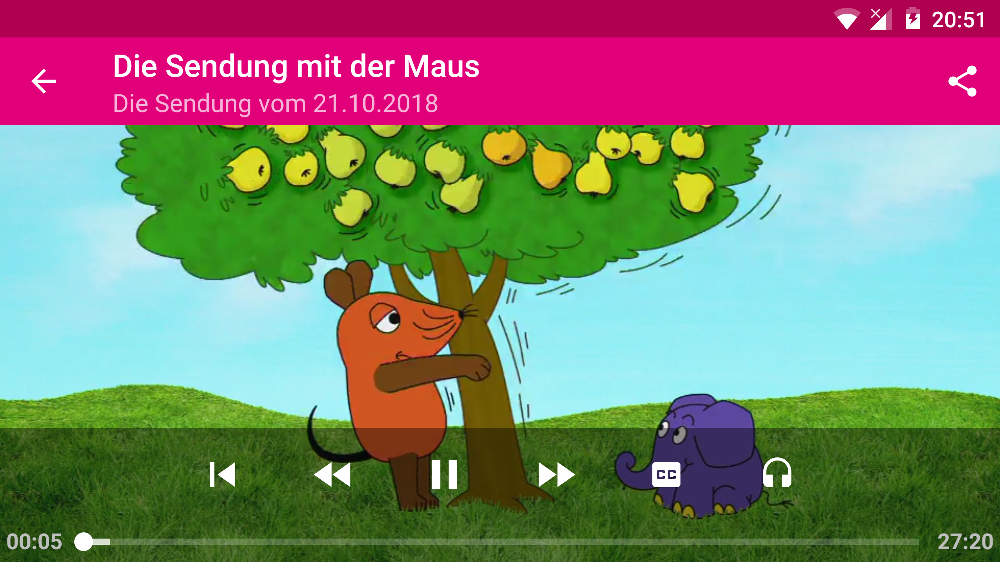
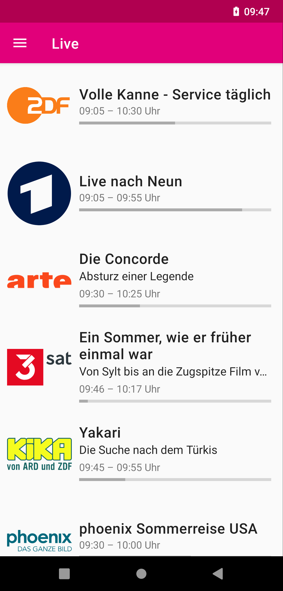
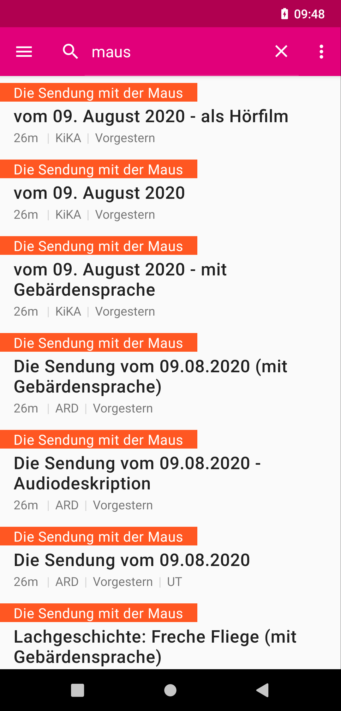
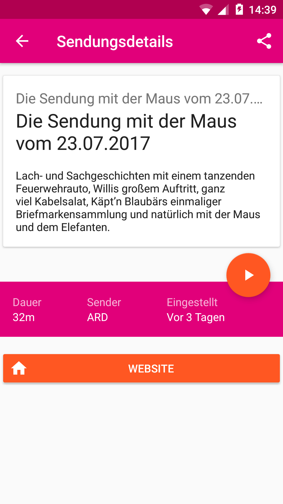

1. [About](#about)
2. [FAQ](app/src/main/res/raw/faq.markdown)
3. [Libraries Example](#libraries)

## About

Zapp gibt dir schnellen Zugang zu vielen deutschen öffentlich-rechtlichen Fernsehsendern. Schaue ARD, ZDF und andere Sender live oder aus der Mediathek. Zapp macht es einfach, schnell zwischen den Sendern zu wechseln.

**Achtung:** Wenn du Zapp außerhalb deutschlands benutzt, können manche Sender – wie zum Beispiel ZDF – geblockt sein.

 

---------------------

## Libraries

Zapp uses a lot of awesome open source libraries:
- [JUnit](http://junit.org/junit4/) to test things out
- [Gson](https://github.com/google/gson) to parse the list of channels
- [Commons IO](https://commons.apache.org/proper/commons-io/) for a sane way to handle files on Android
- [Paperboy](https://github.com/porokoro/paperboy) to easily display a nice looking changelog
- [DragListView](https://github.com/woxblom/DragListView) to let you reorder the channel list intuitively
- [Butterknive](https://jakewharton.github.io/butterknife/) to avoid writing a lot of boilerplate code
- [exo player](https://google.github.io/ExoPlayer/) the better video player
- [Retrofit](https://square.github.io/retrofit/) for easy server api communication
- [Joda time](http://www.joda.org/joda-time/) for sane date and time handling in Java
